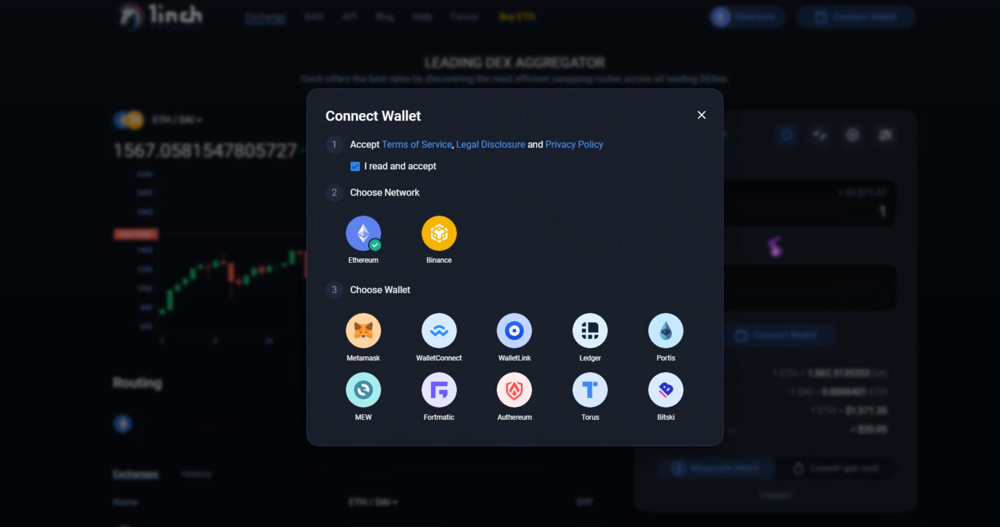

# Buy and sell WOOP on 1inch.exchange

**🔴 It is important to carry out all the configurations from a PC with official links.**

**1- METAMASK**

➦ DOWNLOAD the  plugin [MetaMask](https://metamask.io/) and create your wallet.  
****[**https://www.youtube.com/watch?t=11&v=rEcbsxnTJPE&feature=emb\_imp\_woyt**](https://www.youtube.com/watch?t=11&v=rEcbsxnTJPE&feature=emb_imp_woyt)\*\*\*\*

**➦** SET UP the Binance Smart Chain network and add the WOOP.

\*\*\*\*[**https://www.youtube.com/watch?t=13&v=1MIY-LFTxOw&feature=emb\_imp\_woyt**](https://www.youtube.com/watch?t=13&v=1MIY-LFTxOw&feature=emb_imp_woyt)  
**2-BINANCE**

**➦** SIGN UP on [Binance](https://accounts.binance.com/es/register)

➦ VERIFY your account

[-Tutorial](https://www.binance.com/es/support/faq/360027287111)

➦ BUY BNB on [Binance](https://www.binance.com/es/buy-sell-crypto?channel=hzBankcard&fiat=EUR)

-[Tutorial](https://www.youtube.com/watch?v=KvXONhOu39Y&feature=youtu.be)

**➦** SEND BNBs purchased on Binance to [MetaMask](https://metamask.io/) on Bep-20 \(Binance Smart Chain network\)

[-Tutorial](https://www.youtube.com/watch?v=HJ1cpCBxbY4&feature=youtu.be)

**3- 1inch.exchange**

**➦** Top right, CONNECT your Metamask wallet to the system to be able to perform the swap  
[https://1inch.exchange/\#/BNB/WOOP](https://1inch.exchange/#/BNB/WOOP)  

**➦ CONNECT your Metamask wallet and select the BINANCE network and the Metamask wallet**

**➦ SEARCH the WOOP among the available tokens**

**➦ SELECT the amount you want to buy and give SWAP**

