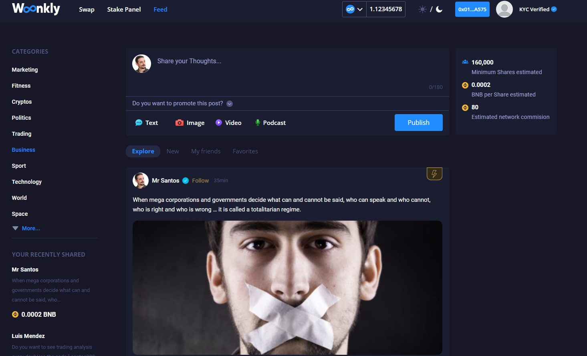
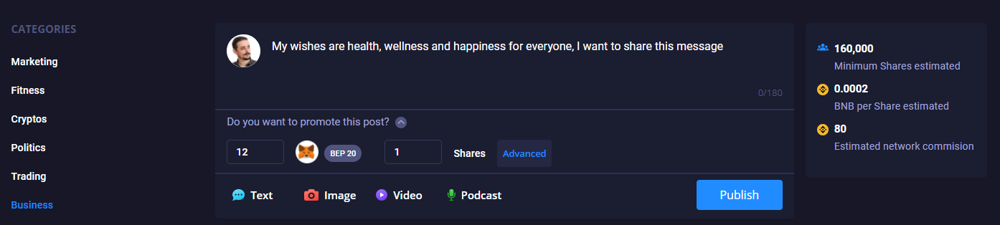
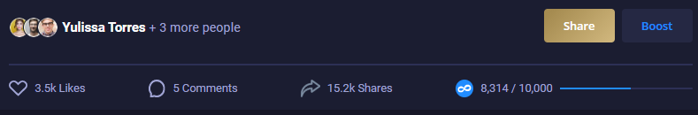
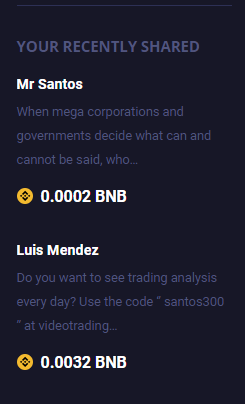
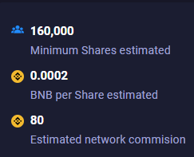
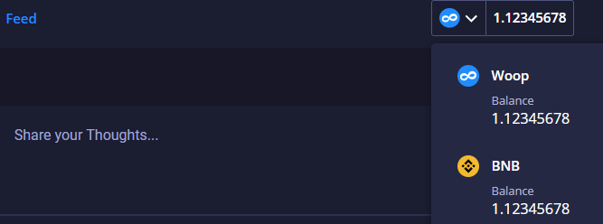

# Decentralized Social Network \(In Process\)

Woonkly is developing a decentralized social network that will see the light of day approximately Q3 2021 in its version 1.0.

The entire social network works on our own Blockchain.

When a user publishes a post, they must sign with their Metamask, since to publish each post a Smart Contract is displayed that interacts with the Woonkly Smart Chain. The texts, photos, videos and audios are hosted within the IPFS network.

Advertisers can advertise their posts by connecting their Metamask to the Binance Smart Chain network and viralize their content by adding BNB or WOOP BEP20 tokens. Users can earn those tokens by viewing and sharing advertisers' content.  

**When an advertiser adds tokens to viralize their content, they will have to pay a gas commission in BNB BEP20 that they must have in their Metamask / Wallet connect. You will be able to campaign with BNB BEP20 and WOOP BEP20 in principle. New tokens of the BEP20 network will be gradually added to be able to carry out campaigns.**  

All this generates complete analytics for the advertiser, which reflects what type of people have seen your post, when they saw it and shared it, what tastes they have, preferences, etc., but always maintaining the anonymity of the users.

Users are also in control of all their data, since instead of being hosted in a database, they are hosted in the Woonkly Smart Chain \(Woonkly Blockchain\). Any user can market their data directly by selling it to advertisers, which gives users full control over their information.

**The Woonkly Decentralized Social Network will be launched approximately in July 2021 and will work on the Woonkly Smart Chain, Binance Smart Chain or another network depending on their operation and efficiency.**  

