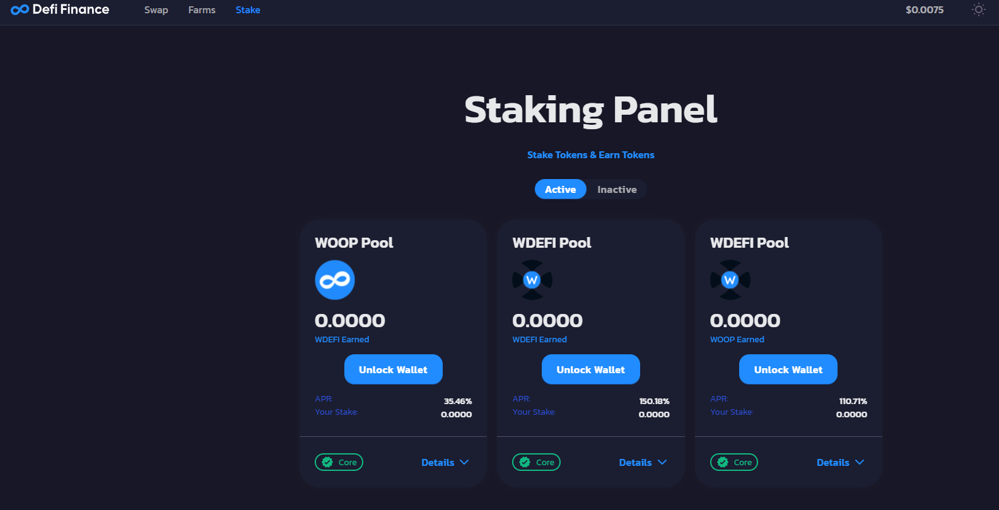

# Stake Pool

Currently, users can stake defi.finance and thus get benefits.  
  
At this moment in V1.2 the tokens enabled to perform Stake are:  
  
WOOP  
  
wDEFI  
  
Work is being done on V2 which will have more features and pairs  
  
Within the Woonkly Stake Panel you can block your tokens to obtain liquidity at any time from 10 WOOP or wDEFI, being able to add individual units from that minimum amount \(example: 100 + 1\).  
  
The benefits generated by the variable APR stake \(Algorithms that depend on liquidity and the number of stakers at all times\)

