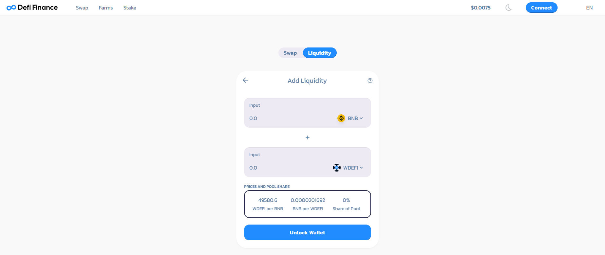

# DEFI.FINANCE V1.2

**This protocol is the skeleton or "core" of three Woonkly products:**  

* This version of defi.finance has its own KYC to comply with the regulations imposed by the state
* The buy-sell swap of the token of the "WOOP" platform, created on Binance Smart Chain.
* The buy-sell swap of the token of the defi.finance platform "wDEFI", created on Binance Smart Chain.
* The DEX Multitoken / Multichain ERC20 / BEP20 that allows to exchange tokens and create liquidity pools within the Ethereum network and within the Binance Smart Chain network. \(In process - Version V2\)
* The DEX Crosschain Bridge between ERC20 and BEP20 Networks that allows to exchange tokens between different blockchains immediately. \(In process - Version V2\)

In Defi.finance users can swap, add liquidity, farm and stake.  
  
Defi.finance has its own inflation token called wDEFI which is the reward token for Stake and Farm users.  
  
**Commissions**  
The Defi.finance swap has a low commission compared to what exists today in the market, with the particularity that 100% of the commission in this V1.2 is "burned" or used to buy back tokens that will be deleted from the system with the objective of circumventing inflation.  

On the home page it is indicated:

Market Cap

Total Minted

Total Burned

Circulation Supply

New wDEFI / Block

In the Swap section, you can perform a "swap" exchange between the defi.finance protocol tokens, as well as adding and withdrawing liquidity, in the selected pairs, obtaining an LP \(Liquidity provider\) Token assigned for adding liquidity to the protocol.

In the Farms section, it is possible to win "wDEFI" which is the platform's native token, obtaining the benefits according to the APR available in each pool. It is also possible to collect by doing "Harvest" of the benefits granted

The APR is a variable algorithm based on the amount of liquidity in the pool and the number of people in it, performing the farming tasks

At this time of V1.2, the following pools are enabled:

WOOP-BNB LP

wDEFI-BNB LP

wDEFI-BUSD LP

WOOP-BUSD LP

In the Stake Panel section, you can obtain benefits when performing Stake.

At this moment in V1.2 the tokens enabled to perform Stake are:

WOOP

wDEFI

Work is being done on V2.  
  
****

  

  

