# NFT.FINANCE

To make a profile within Nft.finance it is necessary to pass the KYC process which allows us to guarantee authenticity to buyers.

We use two standards for non-expendable tokens ERC721 and ERC1155. The ERC-1155 token is a digital token standard created by Witek Radomski, Andrew Cooke, Philippe Castonguay, James Therien, Eric Binet, and Ronan Sandford. This new token can be used to create fungible and non-fungible assets on the blockchain. Using the network, ERC-1155 tokens are secure, interchangeable, and immune to hacking, and the development community can start building applications that integrate ERC-1155 assets with full confidence that the current standard is future-proof.

This new token has design features that give it some very interesting new functionalities, such as transferring multiple types of tokens at the same time, saving on transaction costs. With its implementation, it is possible to trade \(escrow / atomic swaps\) of multiple tokens on this standard and eliminate the need to "approve" individual token contracts separately. Also, as already mentioned, it is easy to describe and mix multiple types of fungible or non-fungible tokens in a single contract.  
 

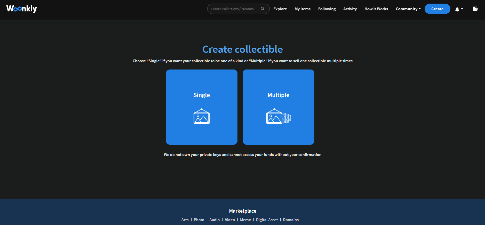

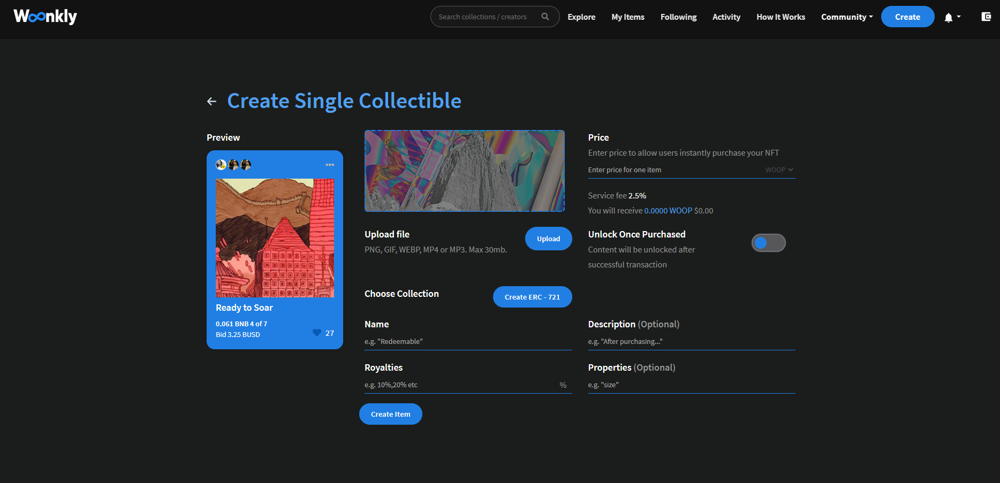

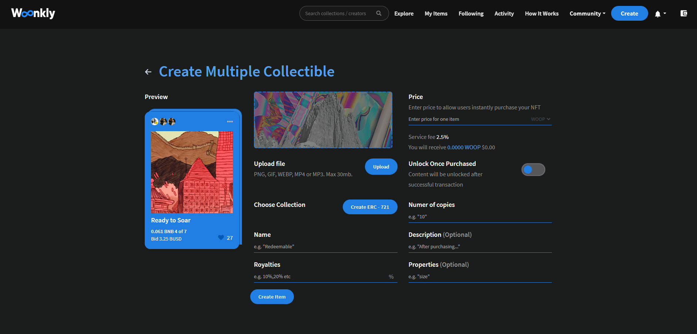

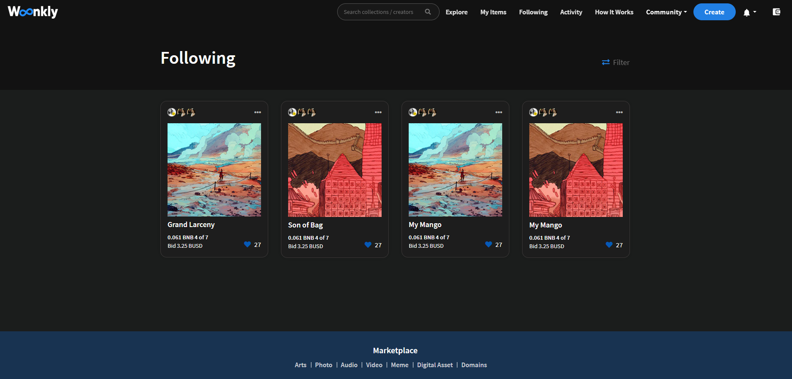

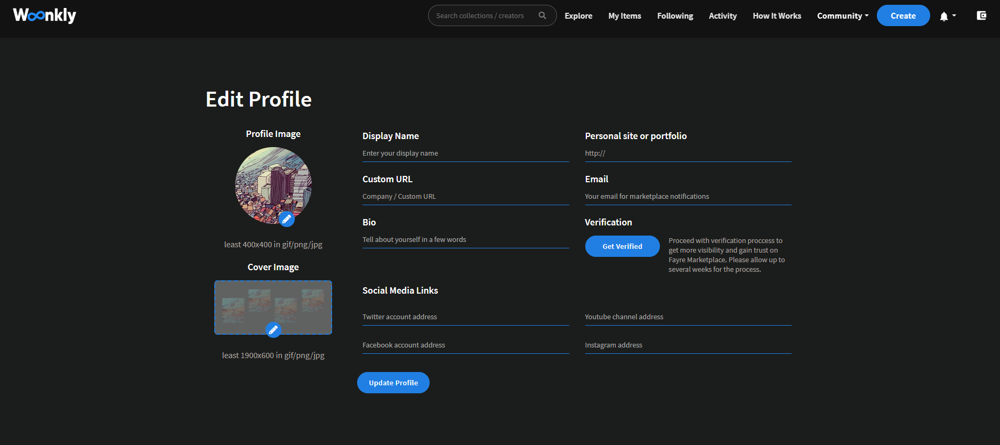

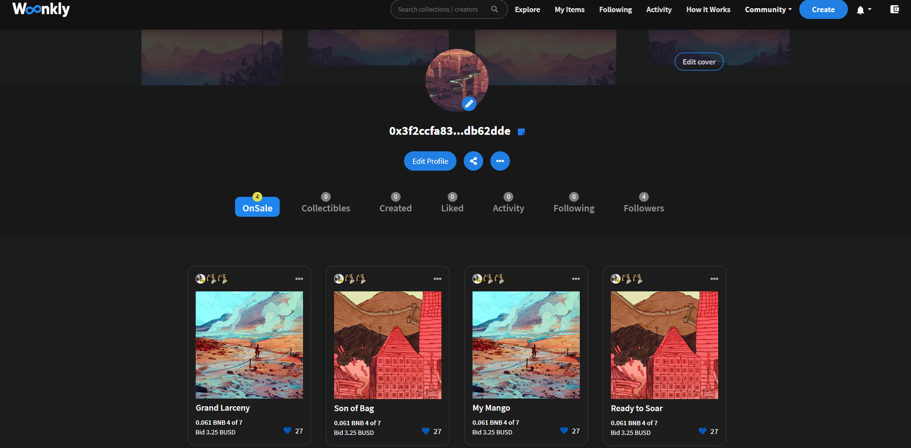

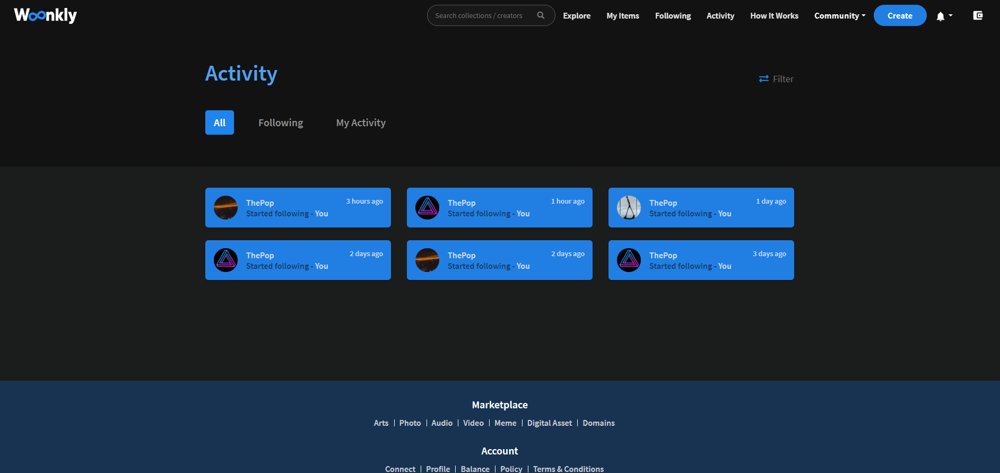

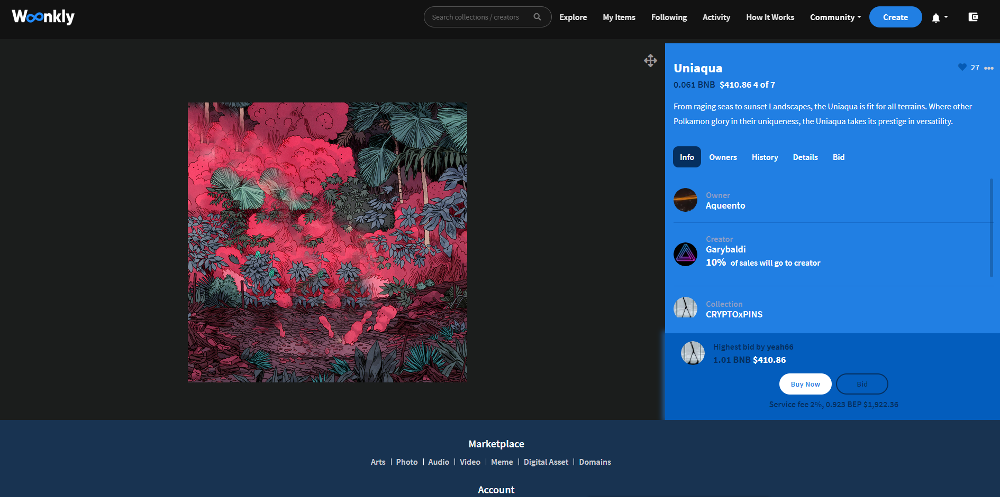

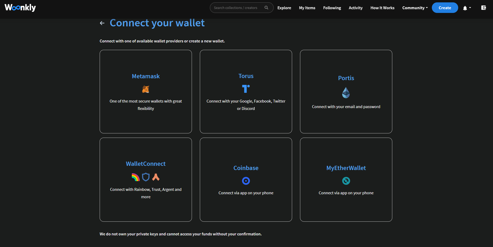

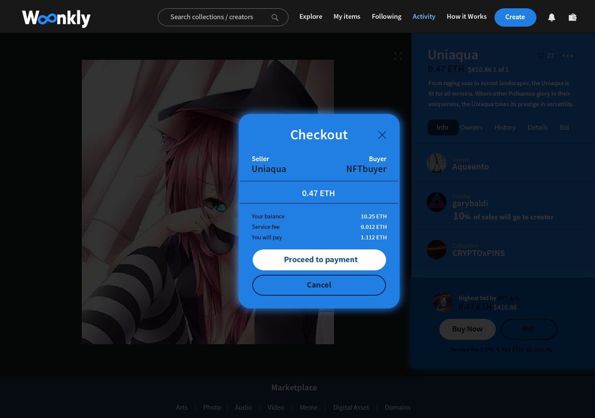

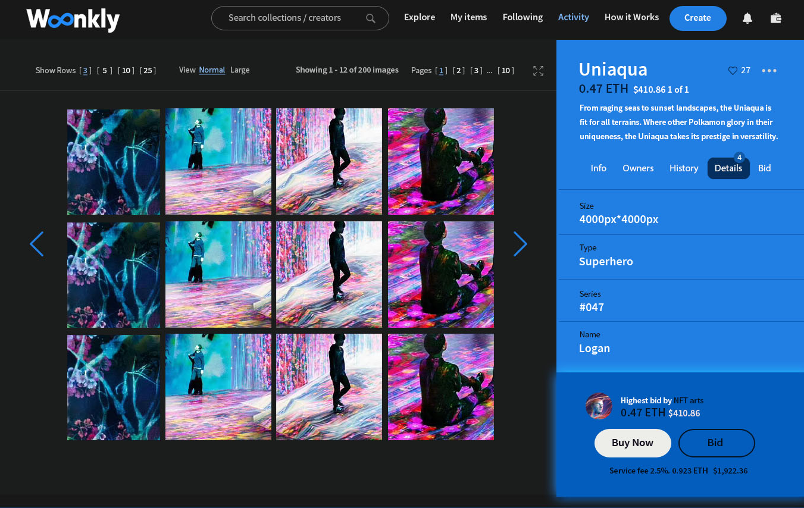

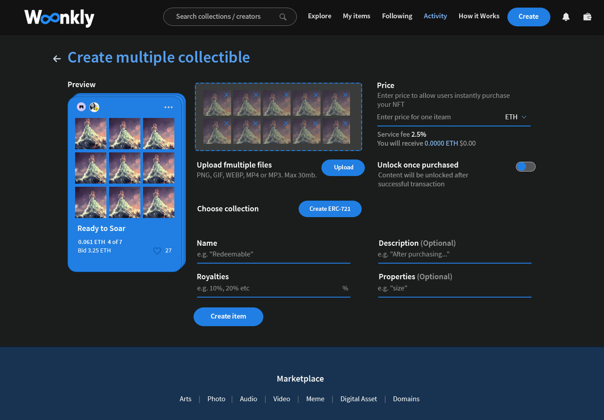

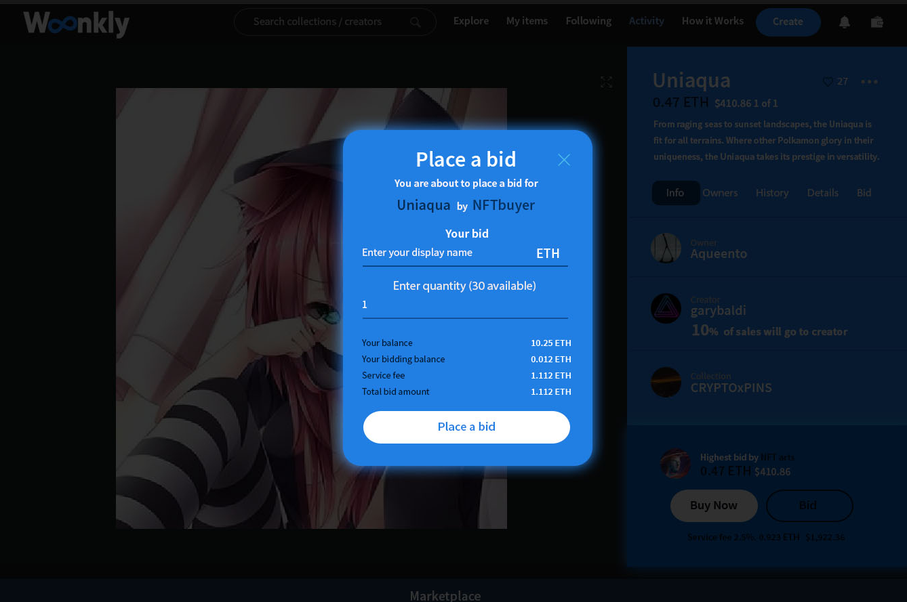

